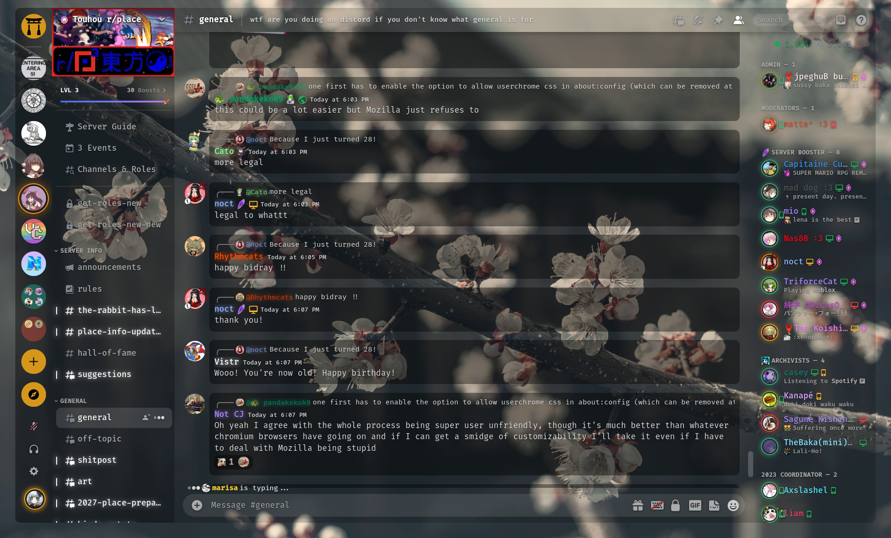

<h1 align=center>Corolla</h1> 

 

**Highly customizable** and **hybrid** discord theme crossing over the good components of [SoftX](https://github.com/DiscordStyles/SoftX) and [Translucence](https://github.com/CapnKitten/Translucence) for the **best user experience while revamping most of the ui components**.

To get going, paste `@import url("https://raw.githubusercontent.com/SidonTheTroll/Corolla/main/stable.css");` in the Quick Css menu.

 

Keep in mind that **FUTURE CSS UPDATES MAY BREAK THE THEME**.

---

Started project on 18th November 2023.  
Thanks NeoVim team. 
